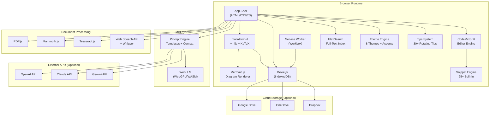
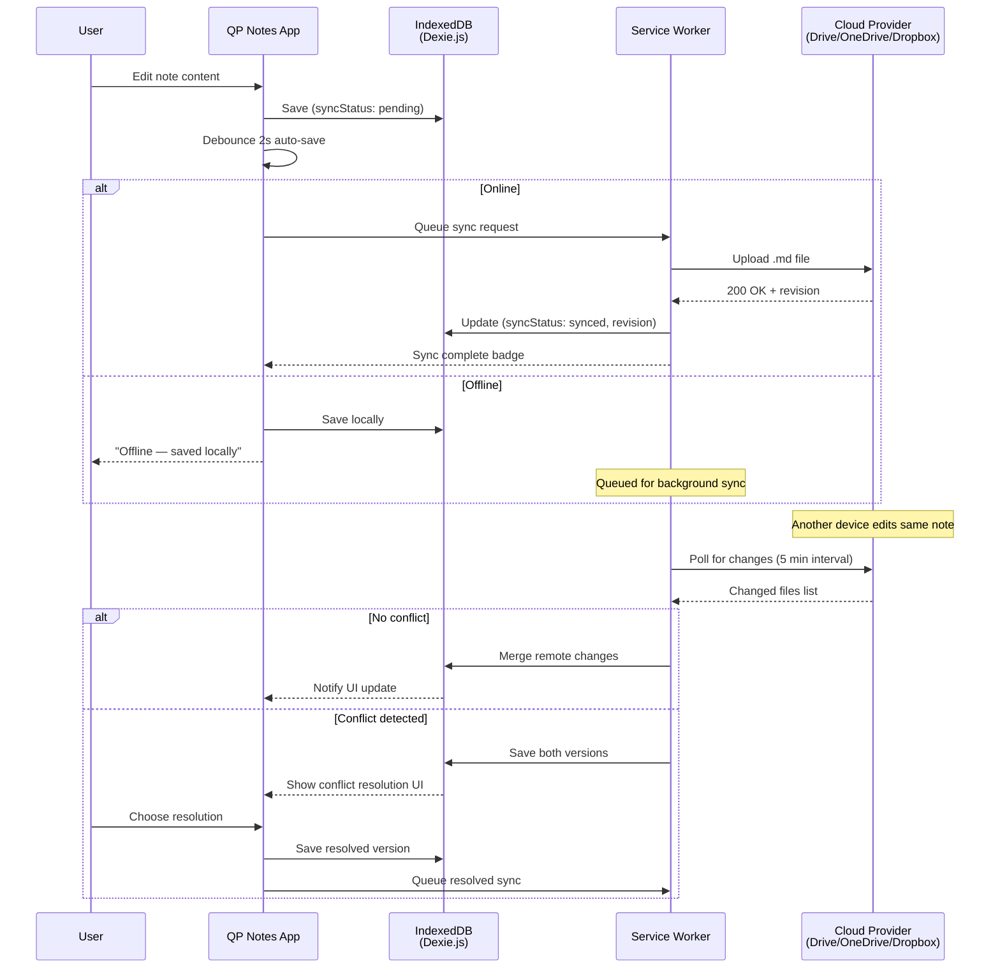
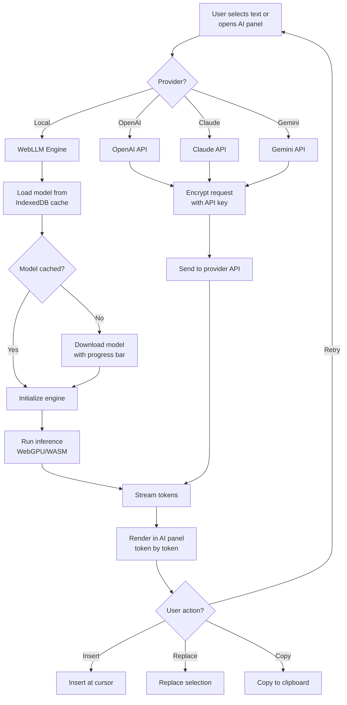
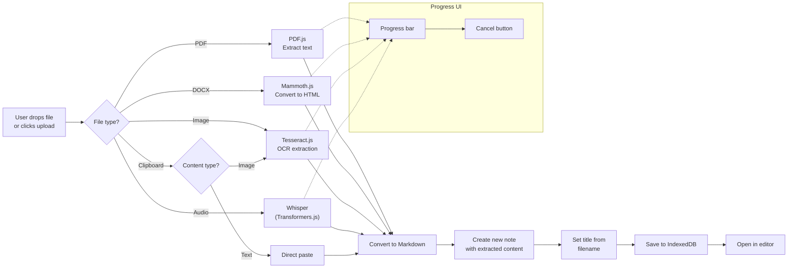
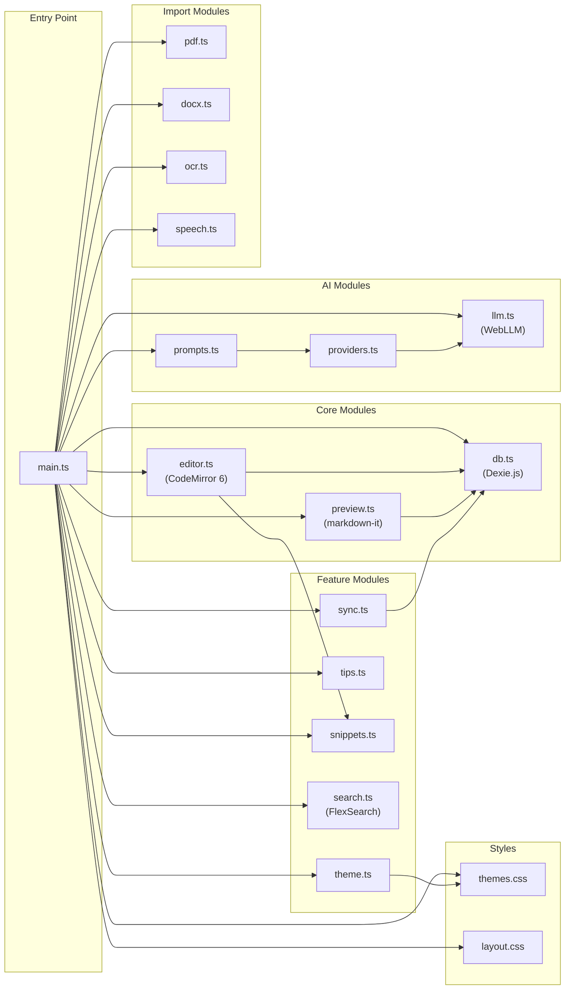

# Architecture & Diagrams

## System Architecture

```mermaid
graph TB
    subgraph "Browser Runtime"
        UI["App Shell<br/>(HTML/CSS/TS)"]
        CM["CodeMirror 6<br/>Editor Engine"]
        MD["markdown-it<br/>+ hljs + KaTeX"]
        MM["Mermaid.js<br/>Diagram Renderer"]
        SW["Service Worker<br/>(Workbox)"]
        DB["Dexie.js<br/>(IndexedDB)"]
        FS["FlexSearch<br/>Full-Text Index"]
        TH["Theme Engine<br/>8 Themes + Accents"]
        SN["Snippet Engine<br/>25+ Built-in"]
        TP["Tips System<br/>30+ Rotating Tips"]
    end

    subgraph "AI Layer"
        WL["WebLLM<br/>(WebGPU/WASM)"]
        PR["Prompt Engine<br/>Templates + Context"]
    end

    subgraph "External APIs (Optional)"
        OA["OpenAI API"]
        CL["Claude API"]
        GM["Gemini API"]
    end

    subgraph "Cloud Storage (Optional)"
        GD["Google Drive"]
        OD["OneDrive"]
        DX["Dropbox"]
    end

    subgraph "Document Processing"
        PDF["PDF.js"]
        DOC["Mammoth.js"]
        OCR["Tesseract.js"]
        SPE["Web Speech API<br/>+ Whisper"]
    end

    UI --> CM
    UI --> MD
    UI --> TH
    UI --> TP
    CM --> SN
    MD --> MM
    MD --> DB
    UI --> FS
    UI --> DB
    SW --> DB

    UI --> PR
    PR --> WL
    PR --> OA
    PR --> CL
    PR --> GM

    DB --> GD
    DB --> OD
    DB --> DX

    UI --> PDF
    UI --> DOC
    UI --> OCR
    UI --> SPE
```

## Data Sync Flow

```mermaid
sequenceDiagram
    participant User
    participant App as QP Notes App
    participant DB as IndexedDB<br/>(Dexie.js)
    participant SW as Service Worker
    participant Cloud as Cloud Provider<br/>(Drive/OneDrive/Dropbox)

    User->>App: Edit note content
    App->>DB: Save (syncStatus: pending)
    App->>App: Debounce 2s auto-save

    alt Online
        App->>SW: Queue sync request
        SW->>Cloud: Upload .md file
        Cloud-->>SW: 200 OK + revision
        SW->>DB: Update (syncStatus: synced, revision)
        SW-->>App: Sync complete badge
    else Offline
        App->>DB: Save locally
        App-->>User: "Offline — saved locally"
        Note over SW: Queued for background sync
    end

    Note over Cloud: Another device edits same note

    SW->>Cloud: Poll for changes (5 min interval)
    Cloud-->>SW: Changed files list

    alt No conflict
        SW->>DB: Merge remote changes
        DB-->>App: Notify UI update
    else Conflict detected
        SW->>DB: Save both versions
        DB-->>App: Show conflict resolution UI
        User->>App: Choose resolution
        App->>DB: Save resolved version
        App->>SW: Queue resolved sync
    end
```

## LLM Processing Flow

```mermaid
flowchart TD
    A[User selects text or<br/>opens AI panel] --> B{Provider?}

    B -->|Local| C[WebLLM Engine]
    B -->|OpenAI| D[OpenAI API]
    B -->|Claude| E[Claude API]
    B -->|Gemini| F[Gemini API]

    C --> G[Load model from<br/>IndexedDB cache]
    G --> H{Model cached?}
    H -->|Yes| I[Initialize engine]
    H -->|No| J[Download model<br/>with progress bar]
    J --> I

    D --> K[Encrypt request<br/>with API key]
    E --> K
    F --> K
    K --> L[Send to provider API]

    I --> M[Run inference<br/>WebGPU/WASM]

    M --> N[Stream tokens]
    L --> N

    N --> O[Render in AI panel<br/>token by token]
    O --> P{User action?}

    P -->|Insert| Q[Insert at cursor]
    P -->|Replace| R[Replace selection]
    P -->|Copy| S[Copy to clipboard]
    P -->|Retry| A
```

## Document Upload Flow

```mermaid
flowchart LR
    A[User drops file<br/>or clicks upload] --> B{File type?}

    B -->|PDF| C["PDF.js<br/>Extract text"]
    B -->|DOCX| D["Mammoth.js<br/>Convert to HTML"]
    B -->|Image| E["Tesseract.js<br/>OCR extraction"]
    B -->|Audio| F["Whisper<br/>(Transformers.js)"]
    B -->|Clipboard| G{Content type?}

    G -->|Image| E
    G -->|Text| H[Direct paste]

    C --> I[Convert to Markdown]
    D --> I
    E --> I
    F --> I
    H --> I

    I --> J[Create new note<br/>with extracted content]
    J --> K[Set title from<br/>filename]
    K --> L[Save to IndexedDB]
    L --> M[Open in editor]

    subgraph "Progress UI"
        N[Progress bar] --> O[Cancel button]
    end

    C -.-> N
    D -.-> N
    E -.-> N
    F -.-> N
```

## Component Dependency Graph

```mermaid
graph LR
    subgraph "Entry Point"
        Main["main.ts"]
    end

    subgraph "Core Modules"
        Editor["editor.ts<br/>(CodeMirror 6)"]
        Preview["preview.ts<br/>(markdown-it)"]
        DB["db.ts<br/>(Dexie.js)"]
    end

    subgraph "Feature Modules"
        Theme["theme.ts"]
        Tips["tips.ts"]
        Snippets["snippets.ts"]
        Search["search.ts<br/>(FlexSearch)"]
        Sync["sync.ts"]
    end

    subgraph "AI Modules"
        LLM["llm.ts<br/>(WebLLM)"]
        Prompts["prompts.ts"]
        Providers["providers.ts"]
    end

    subgraph "Import Modules"
        PDFMod["pdf.ts"]
        DocxMod["docx.ts"]
        OCRMod["ocr.ts"]
        SpeechMod["speech.ts"]
    end

    subgraph "Styles"
        ThemeCSS["themes.css"]
        LayoutCSS["layout.css"]
    end

    Main --> Editor
    Main --> Preview
    Main --> DB
    Main --> Theme
    Main --> Tips
    Main --> Snippets

    Editor --> Snippets
    Editor --> DB
    Preview --> DB

    Main --> Search
    Main --> Sync
    Sync --> DB

    Main --> LLM
    Main --> Prompts
    Prompts --> Providers
    Providers --> LLM

    Main --> PDFMod
    Main --> DocxMod
    Main --> OCRMod
    Main --> SpeechMod

    Main --> ThemeCSS
    Main --> LayoutCSS
    Theme --> ThemeCSS
```
